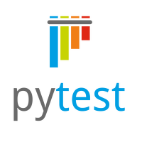
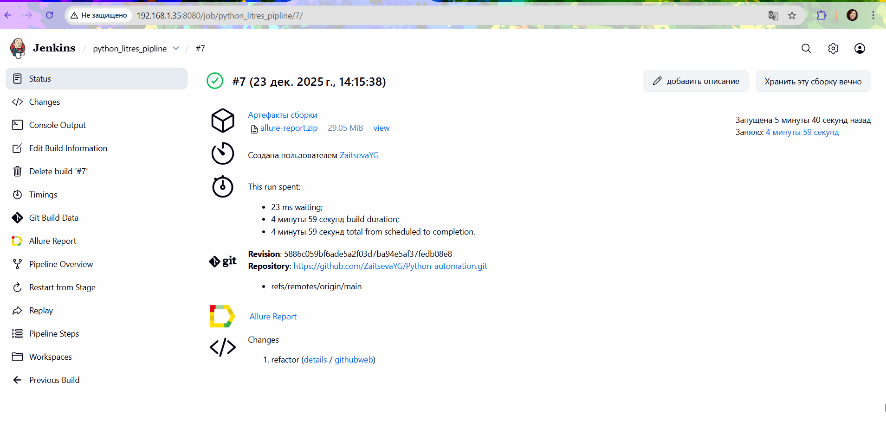
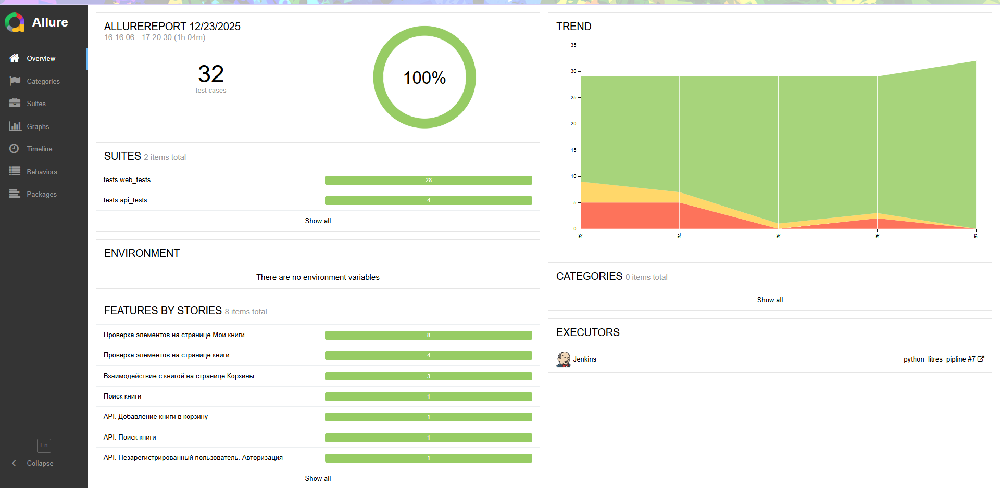
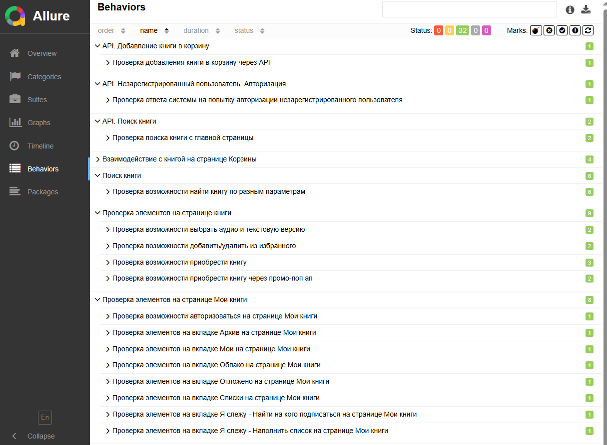
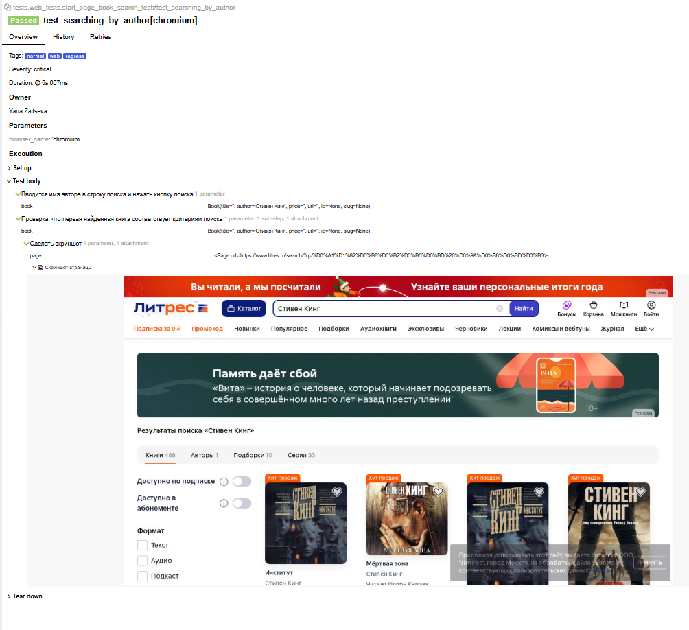
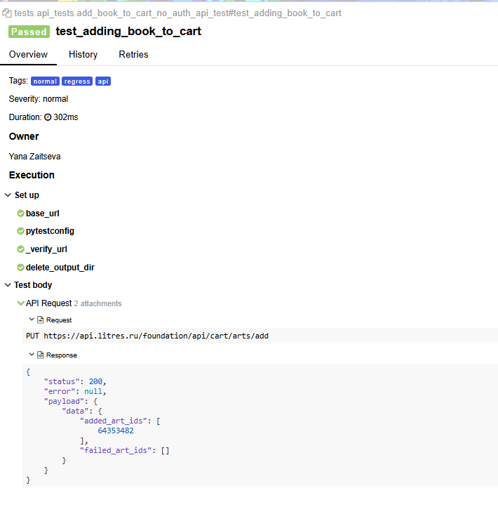
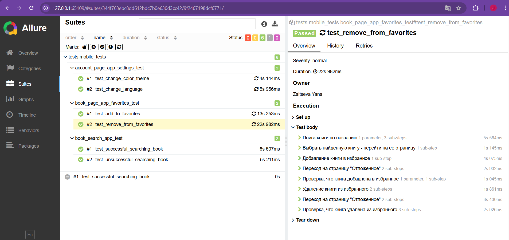

<h1> Проект по тестированию сервиса электронных и аудиокниг "Литрес"</h1>

> <a target="_blank" href="https://www.litres.ru">Ссылка на сайт</a>


<h3> Список проверок, реализованных в автотестах:</h3>

### UI-тесты

- [x] Поиск книги
- [x] Добавление книги в корзину
- [x] Удаление книги из корзины
- [x] Добавление книги в Избранное
- [x] Удаление книги из Избранного
- [x] Проверка элементов на странице книги
- [x] Проверка элементов на странице "Мои книги"

### API-тесты

- [x] Поиск книги
- [x] Добавление книги в корзину
- [x] Попытка авторизации незарегистрированным пользователем

### Mobile-тесты
- [x] Поиск книги(успешный и неуспешный)
- [x] Добавление книги в Сохраненное
- [x] Удаление книги из Сохраненного
- [x] Смена цветовой темы приложения
- [x] Изменение языка интерфейса

----
### Проект реализован с использованием:
        

----
### Локальный запуск
> Для локального запуска с дефолтными значениями необходимо выполнить команду:
```
python -m venv .venv
source .venv/bin/activate
pip install poetry
poetry install --no-root
pytest tests
```

----
### Удаленный запуск автотестов выполнялся на сервере Jenkins, поднятом локально



----
### Allure отчет
#### Общие результаты


#### Список тест кейсов

#### Пример отчета о прохождении ui-теста

#### Пример отчета о прохождении api-теста


Мобильное тестирование в данном проекте реализовано на реальном девайсе на платформе Android.  
Для прогона локально тестов необходимо скачать и положить в папку data  <a href="https://drive.google.com/uc?export=download&id=1qAgPymonfSuqqg6CyYDRi-62NJxYD-Uh">apk файл</a>.

#### Пример отчета о прохождении mobile-теста


### Пример видео прохождения mobile-автотестoв

